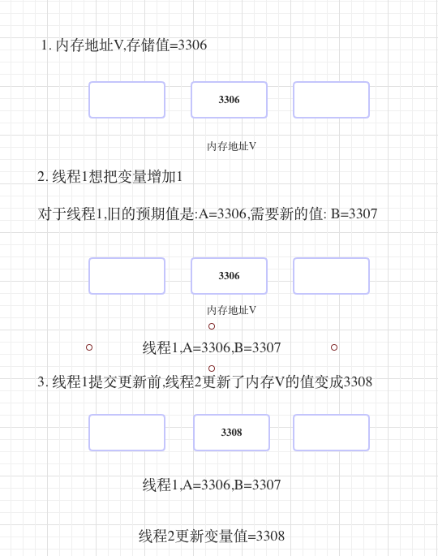
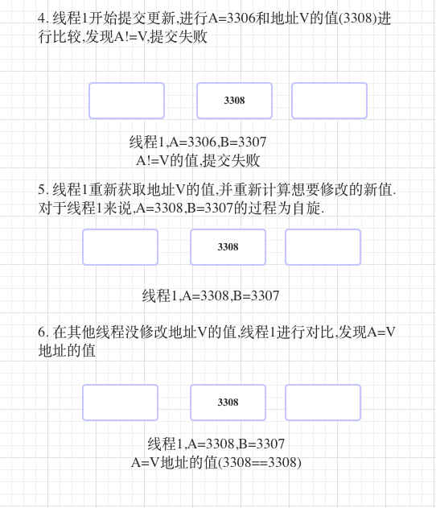
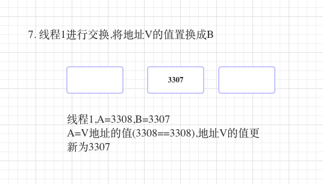

# Java 多线程

Java多线程技术分享文档.演示代码项目 [github link](https://github.com/cs12110/threads-project)

---

### 1. 线程

起初图灵创建了计算机.CPU 是单线程的,内存虚弱.代码的灵运行在打孔纸带上.

#### 1.1 Thread

```java
public class ThreadApp {

    private static LogUtil logUtil = new LogUtil(SimpleThread.class);

    public static class SimpleThread extends Thread {
        @Override
        public void run() {
            try {
                logUtil.info("Function[run] 吉米.巴特勒拿到了x分y篮板z助攻");
                Thread.sleep(2000);
                logUtil.info("Function[run] xx总冠军");
            } catch (Exception e) {
                e.printStackTrace();
            }
        }
    }

    public static void main(String[] args) {
        logUtil.info("Function[main] start up");
        SimpleThread simpleThread = new SimpleThread();
        simpleThread.start();
        logUtil.info("Function[main] end");
    }
}
```

测试结果

```java
2020-10-12 11:36:18,985	[info]	c.p.t.s.ThreadApp$SimpleThread	Function[main] start up
2020-10-12 11:36:18,987	[info]	c.p.t.s.ThreadApp$SimpleThread	Function[run] 吉米.巴特勒拿到了x分y篮板z助攻
2020-10-12 11:36:18,987	[info]	c.p.t.s.ThreadApp$SimpleThread	Function[main] end
2020-10-12 11:36:20,991	[info]	c.p.t.s.ThreadApp$SimpleThread	Function[run] xx总冠军
```

#### 1.2 Runnable

```java
public class RunnableApp {

    private static LogUtil logUtil = new LogUtil(SimpleRunnable.class);

    public static class SimpleRunnable implements Runnable {
        private String threadName;

        public SimpleRunnable(String threadName) {
            this.threadName = threadName;
        }

        @Override
        public void run() {
            try {
                logUtil.info(threadName + "开始执行");
                Thread.sleep(1000);
                logUtil.info(threadName + "执行完成");
            } catch (Exception e) {
                logUtil.error(e.getMessage());
            }
        }
    }

    public static void main(String[] args) {
        for (int index = 0; index < 2; index++) {
            String threadName = "simple-thread" + index;
            SimpleRunnable runnable = new SimpleRunnable(threadName);
            new Thread(runnable).start();
        }
    }
}
```

测试结果

```java
2020-08-06 15:27:32,051	[info]	com.pkg.threads.simple.RunnableApp$SimpleRunnable	simple-thread1开始执行
2020-08-06 15:27:32,051	[info]	com.pkg.threads.simple.RunnableApp$SimpleRunnable	simple-thread0开始执行
2020-08-06 15:27:33,054	[info]	com.pkg.threads.simple.RunnableApp$SimpleRunnable	simple-thread1执行完成
2020-08-06 15:27:33,054	[info]	com.pkg.threads.simple.RunnableApp$SimpleRunnable	simple-thread0执行完成
```

#### 1.3 Callable

```java
public class CallableApp {
    private static LogUtil logUtil = new LogUtil(SimpleCallable.class);

    public static class SimpleCallable implements Callable<Object> {
        @Override
        public Object call() {
            try {
                Thread.sleep(3000);
            } catch (Exception e) {
                e.printStackTrace();
            }
            return "2nd & 11";
        }
    }

    public static void main(String[] args) {
        SimpleCallable callable = new SimpleCallable();

        logUtil.info("Function[main] start up");
        FutureTask<Object> futureTask = new FutureTask<>(callable);
        new Thread(futureTask).start();
        try {
            Object o = futureTask.get();
            logUtil.info("Function[main] callable value:{}", o);
        } catch (Exception e) {
            logUtil.error(e.getMessage());
        }
    }
}
```

测试结果

```java
2020-10-12 10:14:01,337	[info]	c.p.t.s.CallableApp$SimpleCallable	Function[main] start up
2020-10-12 10:14:04,445	[info]	c.p.t.s.CallableApp$SimpleCallable	Function[main] callable value:2nd & 11
```

#### 1.4 小节总结

ta 那时候还太年轻,不知道所有 Java 里面的线程,早已在暗中标好了价格.

多线程使用准则第一条: **如果能用一条线程解决,就千万别用两条线程.**

<span style='color:pink'>Q:</span> <u>如果采用 Thread 或者 Runnable 实现多线程,使用哪种比较好?</u>

A: 推荐使用 Runnable,因为 Java 的单继承原则.

---

### 2. 线程池

如果频繁的创建线程和销毁会导致资源的损耗,所以使用池的方式来降低资源损耗.

<span style='color:red'>FBI Warning:</span>**线程池不会自动关闭.**

#### 2.1 ThreadPoolExecutor

```java
public static ThreadPoolExecutor build() {
    // 线程池核心数量
    int coreSize = 2;
    // 线程池最大数量
    int maxSize = 2;
    // 空余线程被回收时间单位
    int keepAliveTime = 0;
    TimeUnit timeUnit = TimeUnit.SECONDS;

    // 队列???
    ArrayBlockingQueue<Runnable> queue = new ArrayBlockingQueue<>(10);
    // LinkedBlockingQueue<Runnable> queue = new LinkedBlockingQueue<>();
    NamingThreadFactory threadFactory = new NamingThreadFactory("tom&jerry");

    // 构建线程池
    return new ThreadPoolExecutor(coreSize, maxSize, keepAliveTime, timeUnit, queue, threadFactory);
}
```

- coreSize: 线程池核心线程数
- maxSize: 线程池最大线程数
- keepAliveTime 和 unit: 两个组合使用,表示空闲的线程(只回收>coresize 的线程)在多少时间后被回收,最多缩减为 coresize 数量
- queue: 等待队列的大小

陆续创建核心线程数大小的线程 -> 消费不过了,放到等待队列里面 -> 队列满了 -> 扩充线程池线程数,最大为最大线程数 -> 队列满了(有边界的队列才会满 `orz`),池已经扩充到最大,还消费不过来-> 默认采取拒绝策略.

线程池策略

- AbortPolicy: 任务丢弃,抛出异常(默认策略).

- DiscardPolicy: 任务直接抛弃,不会抛异常也不会执行.

- DiscardOldestPolicy: 抛弃任务队列中最旧的任务,新任务添加进去.

- CallerRunsPolicy: 调用当前线程池的所在的线程去执行被拒绝的任务.

  ```java
  /**
   * 如果当前线程池尚未关闭,直接执行线程的run方法.
   */
  public void rejectedExecution(Runnable r, ThreadPoolExecutor e) {
    if (!e.isShutdown()) {
      r.run();
    }
  }
  ```

关于线程池的命名: **便于监控查看.**


#### 2.2 Executors

我们不生产代码,我们只是代码的搬运工.jpg

**单线程线程池**

```java
public class ExecutorsApp {

    public static void main(String[] args) {
        /*
         * 创建单个线程的线程池,coreSize=1,maxSize=1,queue=LinkedBlockingQueue
         */
        ExecutorService singleThreadExecutor = Executors.newSingleThreadExecutor();
        ThreadUtil.shutdown(singleThreadExecutor);
    }
}
```

实现原理:

```java
public static ExecutorService newSingleThreadExecutor() {
    return new FinalizableDelegatedExecutorService
        (new ThreadPoolExecutor(1, 1,
                                0L, TimeUnit.MILLISECONDS,
                                new LinkedBlockingQueue<Runnable>()));
}
```

**固定线程池**

```java
public class ExecutorsApp {

    public static void main(String[] args) {
        /*
         * 创建固定线程的线程池,coreSize=2,maxSize=2,queue=LinkedBlockingQueue
         */
        ExecutorService fixedThreadPool = Executors.newFixedThreadPool(2);
        ThreadUtil.shutdown(fixedThreadPool);
    }
}
```

实现原理:

```java
public static ExecutorService newFixedThreadPool(int nThreads) {
        return new ThreadPoolExecutor(nThreads, nThreads,
                                      0L, TimeUnit.MILLISECONDS,
                                      new LinkedBlockingQueue<Runnable>());
}
```

**缓存线程池**

```java
public class ExecutorsApp {

    public static void main(String[] args) {
        /*
         * 创建一直扩展线程的线程池,coreSize=0,maxSize=Integer.MAX_VALUE,queue=SynchronousQueue
         */
        ExecutorService newCachedThreadPool = Executors.newCachedThreadPool();
        ThreadUtil.shutdown(newCachedThreadPool);
    }
}
```

实现原理:

```java
public static ExecutorService newCachedThreadPool() {
    return new ThreadPoolExecutor(0, Integer.MAX_VALUE,
                                    60L, TimeUnit.SECONDS,
                                    new SynchronousQueue<Runnable>());
}
```

**结论**: <u>Executors 底层是 ThreadPoolExecutor 构建的,所以掌握 ThreadPoolExecutor 至关重要.</u>

#### 2.3 小节总结

如果想详细了解线程池的执行原理,可以参考: [线程池执行原理 link](https://mr3306.top/docs/#/javase/java-threadpool?id=_7-%e7%ba%bf%e7%a8%8b%e6%b1%a0%e5%ae%9e%e7%8e%b0%e5%8e%9f%e7%90%86)

线程数的大小设计

• 如果是 CPU 密集型应用,则线程池大小设置为 `CPU 个数+1`

• 如果是 IO 密集型应用,则线程池大小设置为 `2*CPU 个数+1`

---

### 3. Java 内存

这里特指: `Java Memery Model`. :"}

#### 3.1 JMM

- 主内存

主要存储的是 Java 实例对象,所有线程创建的实例对象都存放在主内存中,不管该实例对象是成员变量还是方法中的本地变量(也称局部变量),当然也包括了共享的类信息,常量,静态变量.由于是共享数据区域,多条线程对同一个变量进行访问可能会发现线程安全问题.

- 工作内存

主要存储当前方法的所有本地变量信息(工作内存中存储着主内存中的变量副本拷贝),**每个线程只能访问自己的工作内存,即线程中的本地变量对其它线程是不可见**的,就算是两个线程执行的是同一段代码,它们也会各自在自己的工作内存中创建属于当前线程的本地变量,当然也包括了字节码行号指示器,相关 Native 方法的信息.注意由于工作内存是每个线程的私有数据,线程间无法相互访问工作内存,因此存储在工作内存的数据不存在线程安全问题.


JMM 是围绕原子性,有序性,可见性展开的.

- 原子性: 一个操作是不可中断的,即使是在多线程环境下,一个操作一旦开始就不会被其他线程影响.
- 有序性: 指程序执行的顺序按照代码的先后顺序执行.[link](https://www.cnblogs.com/yeyang/p/13576636.html)
- 可见性: 当一个线程修改了某个共享变量的值,其他线程能否马上得知修改的值.

指令重排: 在执行程序时为提高性能,编译器和处理器的常常会对指令做重排

- 编译器优化重排: 编译器在不改变单线程程序语义的前提下,重新安排语句的执行顺序.
- 指令并行重排: 处理器采用了指令级并行技术来将多条指令重叠执行.如果不存在数据依赖性(即后一个执行的语句无需依赖前面执行的语句的结果),可以改变语句对应的机器指令的执行顺序.

#### 3.2 线程安全

在线程里面所有操作的数据来自该工作内存,操作完成后再刷回主存里面去.

<span style='color:pink'>Q:</span>  在线程执行方法的时候,有哪些数据存放到工作空间里面呀?

A: 根据虚拟机规范,对于一个实例对象中的成员方法而言,如果方法中包含本地变量是基本数据类型(boolean,byte,short,char,int,long,float,double)将直接存储在工作内存的帧栈结构中.但倘若本地变量是引用类型,那么该变量的引用会存储在功能内存的帧栈中.而对象实例将存储在主内存(共享数据区域堆)中.但对于实例对象的成员变量,不管它是基本数据类型或者包装类型(Integer,Double 等)还是引用类型,都会被存储到堆区.至于 static 变量以及类本身相关信息将会存储在主内存中.需要注意的是,在主内存中的实例对象可以被多线程共享.倘若两个线程同时调用了同一个对象的同一个方法.那么两条线程会将要操作的数据拷贝一份到自己的工作内存中.执行完成操作后才刷新到主内存.[link](https://blog.csdn.net/javazejian/article/details/72772461)

<span style='color:pink'>Q:</span> 那么我们有什么方法解决线程安全的问题呀?

A: 共享数据才有线程安全问题.如果需要控制共享数据的线程安全,可以使用 java 的`volatile`,`synchonrized`,`lock`等对数据操作进行控制.

- `volatitle`: 通过内存栅栏禁止指令重排,实现共享变量的可见性,不具备原子性.
- `synchnorized`: 能保证可见性和原子性.
- `lock`: `synchorized` plus.

##### 3.2.1 volatile

`Volatile`: 通过内存屏障(Memory Barrier)禁止指令重排,实现共享变量的可见性,不具备原子性.

指令重排例子如下所示:

```java
线程 1             线程 2
1: x2 = a ;      3: x1 = b ;
2: b = 1;        4: a = 2 ;
```

在上面的例子可以看出

- 线程1的语句2是不依赖语句1的结果

- 线程2的语句4也是不依赖语句3的结果

那么在这种情况下,就看会被编译器优化,对执行指令进行重排,比如在线程2中,语句4执行顺序先于语句3,在线程1中也有可能发生指令重排,语句2执行先于语句1,那么实际中就有可能出现下面的执行结果:

```java
线程 1             线程 2
1: b = 1 ;      3:  a=2 ;
2: x2=a;        4:  x1=b ;
```

内存屏障(Memory Barrier)又称内存栅栏,作用有两个:

- 保证特定操作的执行顺序.
- 保证某些变量的内存可见性.

##### 3.2.2 synchnorized

`Synchnorized`: 具有可见性和原子性,对比volatile多了原子性.

synchronized 最主要有以下 3 种应用方式

- 修饰实例方法: 作用于当前实例加锁,进入同步代码前要获得当前实例的锁.
- 修饰静态方法: 作用于当前类对象加锁,进入同步代码前要获得当前类对象的锁.
- 修饰代码块: 指定加锁对象,对给定对象加锁,进入同步代码库前要获得给定对象的锁.

##### 3.2.3 lock

Lock 对于 Synchnorized 来说是一种升级,有更多的使用方式.例如`ReentrantLock`可以设置公平式锁和非公平式锁.

- 公平式锁: 多个线程按照申请锁的顺序来获取锁.
- 非公平式锁: 多个线程获取锁的顺序并不是按照申请锁的顺序,有可能后申请的线程比先申请的线程优先获取锁.

<span style='color:pink'>Q:</span> <u>那么在什么情况下使用`Lock`,什么情况下使用`Synchnorized`?</u>

A: 如果`Synchnorized`可以完成的功能,就用`Synchnorized`,如果`Synchnorized`完成不了,就使用`ReentrantLock`.

##### 3.2.4 CountdownLatch&Join

在多线程的操作里面,可以看出来如果使用`Thread`或者`Runnable`,在主线程里面是无法知道子线程是否执行完成.

如果主线程依赖子线程的执行,那么就需要其他的手段来控制.例如:`CountdownLatch`和`Join`.

结论: `CountdownLatch`比`Join`更灵活.

#### 3.3 CAS

使用锁(lock)或者synchronize这些,在得到锁执行的时候,会发生上下文切换.如果一些简单的并发控制是不是可以不使用这么复杂的机制来实现?

- 悲观锁: 线程一旦得到锁,其他需要锁的线程挂起等待.

- 乐观锁: 每次不加锁而是假设没有冲突而去完成某项操作,如果冲突失败就重试,直到成功为止.

无锁的实现, compare and swap(对比和转换).CAS 机制当中使用了 3 个基本操作数:`内存地址 V`,`旧的预期值 A`,`新值 B`.





<span style='color:pink'>Q:</span> 那么使用 cas 相关类有什么需要注意的呀?

A: CAS 只能保证自己的原子性,不能保证其他的原子性.自旋时间过长等问题.

#### 3.4 小节总结

这一块几乎是多线程最重要的一块,了解这一块对多线程的数据安全才有把握.

---

### 4. 常见案例

多线程使用的常见案例.

#### 4.1 线程池统计

场景: 用户触发请求,使用线程池进行异步业务逻辑处理.

```java
// 请求次数
int requestTimes = 0;
for (; requestTimes < 2; requestTimes++) {
    ThreadPoolExecutor executor = new ThreadPoolExecutor(2, 2, 0, TimeUnit.SECONDS,
        new ArrayBlockingQueue<>(10), new NightWatcherThreadFactory("counter" + requestTimes + "-"));
    // 异步执行业务1
    executor.submit(new WorkRunnable());
    // 异步执行业务2
    executor.submit(new WorkRunnable());
}

// 返回
logUtil.info("Main method is done");
```

<span style='color:pink'>Q:</span> 这个会出现什么问题?要怎么优化?

A: 出现构建了多个线程池的情况.把线程池移动出去成为 static 全局变量(这个其实也不算合理).

#### 4.2 SimpleDateFormat

问题描述:当 SimpleDateFormat 作为公共变量,多线程调用格式化日期出现异常.

```java
public class SimpleDateFormatIssue {

    private static LogUtil logUtil = LogUtil.get(SimpleDateFormatIssue.class);
    private static SimpleDateFormat sdf = new SimpleDateFormat("yyyy-MM-dd HH:mm:ss");

    private static ThreadLocal<SimpleDateFormat> threadLocal = ThreadLocal
        .withInitial(() -> new SimpleDateFormat("yyyy-MM-dd HH:mm:ss"));

    /**
     * 测试SimpleDateFormat在多线程的情况下出现转换问题
     * <p>
     * 原因: 因为SimpleDateFormat设置为static,多个线程同时共用ta设置里面的成员属性:Calendar
     */
    public static class BugRunner implements Runnable {
        @Override
        public void run() {
            try {
                String dateStr = "1984-03-06 12:00:00";
                Date date = sdf.parse(dateStr);

                // ThreadLocal
                //                SimpleDateFormat simpleDateFormat = threadLocal.get();
                //                Date date = simpleDateFormat.parse(dateStr);

                logUtil
                    .info("Function[run] thread:{},date value:{}", Thread.currentThread().getName(), sdf.format(date));
            } catch (Exception e) {
                logUtil.error("Function[run] thread:" + Thread.currentThread().getName(), e);
            }
        }
    }

    public static void main(String[] args) {
        ThreadPoolExecutor executor = ThreadUtil.fixed("sdf-pool-", 10);

        for (int index = 0; index < 10; index++) {
            executor.submit(new BugRunner());
        }
        ThreadUtil.shutdown(executor);
    }
}
```

#### 4.3 ThreadLocal

调用链路的日志打印,例如 logback 的 mdc.

```java
public class ThreadLocalIssue {

    private static LogUtil logUtil = LogUtil.get(ThreadLocalIssue.class);
    private static ThreadLocal<String> threadLocalCache = new ThreadLocal<>();
    //private static InheritableThreadLocal<String> threadLocalCache = new InheritableThreadLocal<>();

    public static void set(String value) {
        threadLocalCache.set(value);
    }

    public static String get() {
        return threadLocalCache.get();
    }

    public static void remove() {
        threadLocalCache.remove();
    }

    public static class ThreadValueRunner implements Runnable {

        @Override
        public void run() {
            logUtil.info("Function[run] cache value:{}", get());
        }
    }

    public static void main(String[] args) {
        ThreadPoolExecutor pool = ThreadUtil.fixed("local-pool", 2);

        set("haiyan");
        method1();
        set("value2");
        method2();

        pool.submit(new ThreadValueRunner());
        pool.submit(new ThreadValueRunner());
    }

    public static void method1() {
        logUtil.info("Function[method1] cache value:{}", get());
    }

    public static void method2() {
        logUtil.info("Function[method2] cache value:{}", get());
    }

    public static void method3() {
        logUtil.info("Function[method3] after remove:{}", get());
    }
}
```

<span style='color:pink'>Q:</span>  上面的代码有什么问题?该如何改进?

输出结果

```java
2020-10-09 11:12:25,914	[info]	c.p.t.i.ThreadLocalIssue	Function[method1] cache value:haiyan
2020-10-09 11:12:25,915	[info]	c.p.t.i.ThreadLocalIssue	Function[method2] cache value:value2
2020-10-09 11:12:25,917	[info]	c.p.t.i.ThreadLocalIssue	Function[run] cache value:null
2020-10-09 11:12:25,917	[info]	c.p.t.i.ThreadLocalIssue	Function[run] cache value:null
```

<span style='color:pink'>Q:</span> 多线程的情况,例如 spring 的 event 那种还能获取出来吗?

#### 4.4 小节总结

了解更多案例,可参考: [fucking-java-concurrency github link](https://github.com/oldratlee/fucking-java-concurrency)

---

### 5. 致谢

多年以后,我站在施工队的砖头前,准会想起给各位大佬讲多线程演义的那个遥远的午后.

**参考文档**

a. [全面理解 Java 内存模型(JMM)及 volatile 关键字 link](https://blog.csdn.net/javazejian/article/details/72772461)

b. [深入理解 Java 并发之 synchronized 实现原理 link](https://blog.csdn.net/javazejian/article/details/72828483)

c. [ThreadLocal 原理 link](https://mr3306.top/docs/#/javase/java-threadlocal)

d. [线程池执行原理 link](https://mr3306.top/docs/#/javase/java-threadpool)
